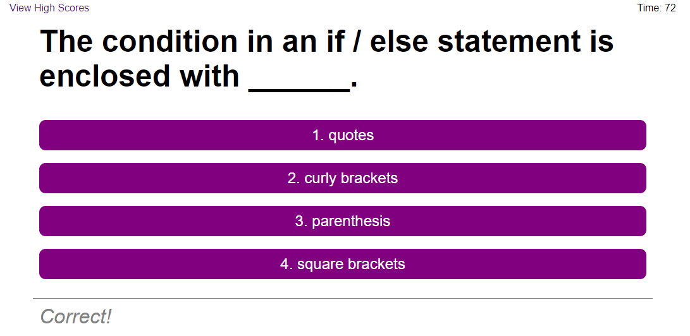

# Javascript Quiz
This is a fully functional quiz with questions based on JavaScript.
Some of the features include:
- A timer that determines your score
- Timer that goes down when you answer wrong
- Multiple questions with responses that tell you if you choose right or wrong
- Submit score with initials after finishing quiz
- A page with all highscores and a way to go back
- A button that will clear saved scores

An example of what the website looks like:

